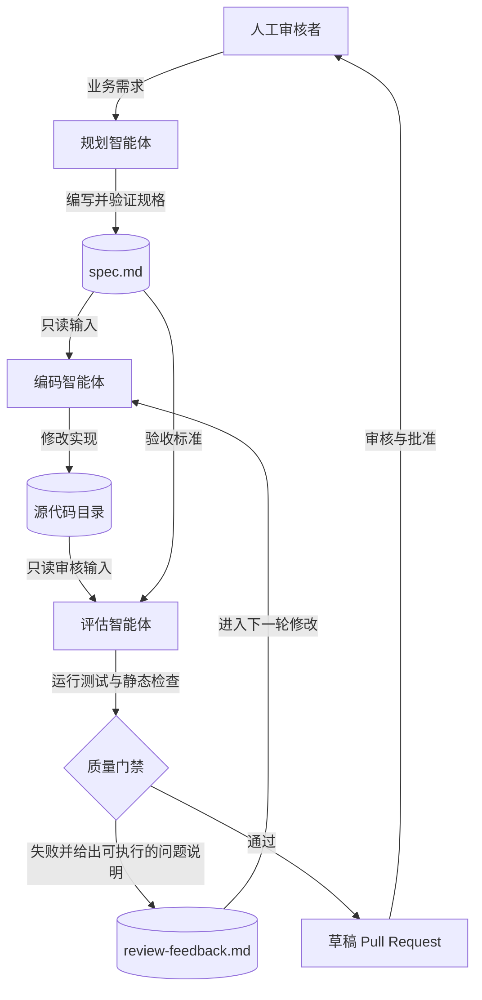
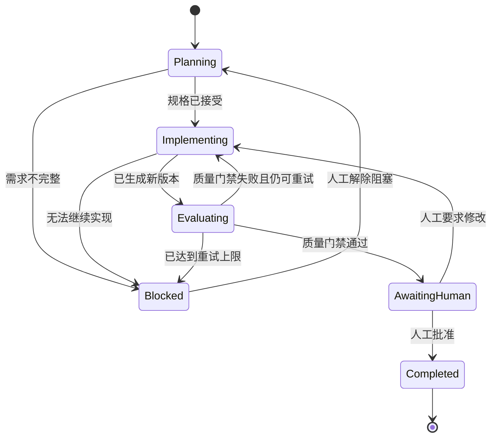

# mrg 架构

本文档是多智能体工作流的架构基准。流程图描述控制流，后续契约定义实现必须保持的行为。

## 系统上下文

## 工作流状态

状态标识 `Planning`、`Implementing`、`Evaluating`、`AwaitingHuman`、`Blocked` 和 `Completed` 是实现层使用的稳定值，不应随展示文案翻译。

## 智能体契约

### 规划智能体

- 读取需求及相关仓库上下文。
- 编写 `spec.md`，内容包括范围、假设、验收标准、约束、受影响接口和验证方案。
- 不修改生产代码。
- 明确标记尚未确定的产品决策，不自行虚构需求。

### 编码智能体

- 将已接受的 `spec.md` 作为实现契约。
- 只修改规格要求的文件，并遵守 `skills/architecture-first-engineering/SKILL.md`。
- 执行验证方案中指定的检查，并记录命令结果。
- 不得为了获得通过结果而削弱测试或质量门禁。

### 评估智能体

- 根据规格和可观察行为独立审核实现。
- 独立执行测试、静态分析和针对性检查，不直接采信编码智能体的报告。
- 编写 `review-feedback.md`；每个失败项必须包含严重程度、文件或位置、证据和明确的预期结果。
- 只有全部验收标准和必需检查均通过时才能返回通过。
- 以评估智能体身份工作时不修改生产代码。

### 人工审核者

- 解决不明确的需求、批准例外，并负责最终合并决策。
- 任何通过质量门禁的版本仍需人工审核后才能合并或发布。

## 调度器职责

调度器负责流程编排，不承载业务逻辑。它必须：

1. 持久化当前状态、尝试次数、产物和命令结果。
2. 仅向每个智能体提供其契约声明的输入。
3. 在状态推进前验证必需产物。
4. 应用可配置的重试上限，并在连续失败后停止。
5. 保存完整执行日志，同时移除密钥和凭据。
6. 在合并、部署或其他不可逆操作前要求人工批准。

## 产物规范

`spec.md` 必须包含：

- 问题描述和期望行为
- 范围内与范围外工作
- 假设和待确认问题
- 以可观察结果表述的验收标准
- 技术约束和受影响接口
- 验证命令或检查项

`review-feedback.md` 必须包含：

- 总体结果：`PASS` 或 `FAIL`
- 已执行的检查及其结果
- 按严重程度排序的问题
- 每个失败项的证据和复现步骤
- 剩余风险或跳过的检查

## 质量门禁

只有同时满足以下条件，版本才能通过：全部验收标准已满足；必需检查成功退出；不存在尚未解决的高严重程度问题；没有跳过必需验证。缺少证据时，调度器必须判定失败，不得默认通过。

## 变更规则

当智能体职责、工作流状态、产物契约、审批边界或质量门禁发生变化时，必须在同一次变更中更新本文档。只要这些契约保持不变，实现细节可以独立演进。
