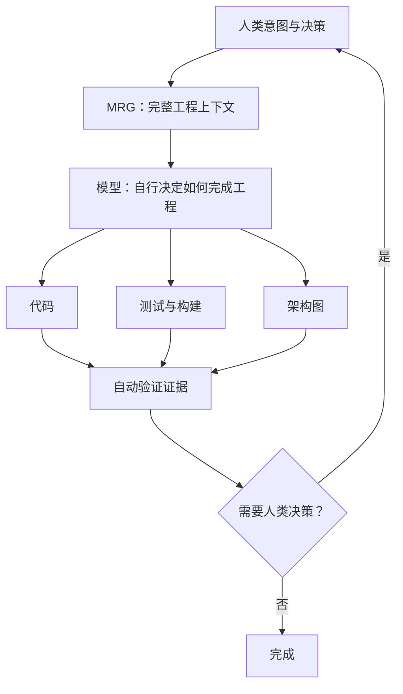

# MRG 架构

## 研究对象

MRG 不是流程控制器，也不是 Agent 角色集合。它为模型提供一个完整的软件工程世界：问题、代码、文件系统、Git、终端、构建、测试、架构产物和人类决策。

模型观察结果、判断下一步、采取行动，再观察结果并继续判断。模型自己决定是否需要计划、规格、评审、额外模型或架构图。

## 人类边界

人类保留需求和产品取舍、高风险决策、架构方向、不可逆操作，以及模型无法从代码和工具事实中解决的歧义。人类不应成为默认的逐行代码审核器；模型应把工作压缩为人能快速理解的结果：任务、架构变化、关键改动、验证证据、风险和待决策事项。

## 工程闭环

## 实验基线

Planner、Coder、Evaluator、Quality Gate 流程可以作为第一阶段基线，用来测量减少人工先验后的能力变化。它们不是最终架构；如果模型能自行完成相同闭环，就应撤掉对应的固定角色和规则。

## 最小上下文原则

- Skill 越少，人工先验越少，模型自由度越高。
- Skill 只表达目标、边界和结果，不积累“某个模型常犯什么错”的经验清单。
- 不强制 DDD、Clean Architecture、Strategy、Factory、Java 风格或固定文档流程。
- 评估重点是结果质量、验证证据和人类注意力消耗，而不是模型是否遵循预设步骤。
