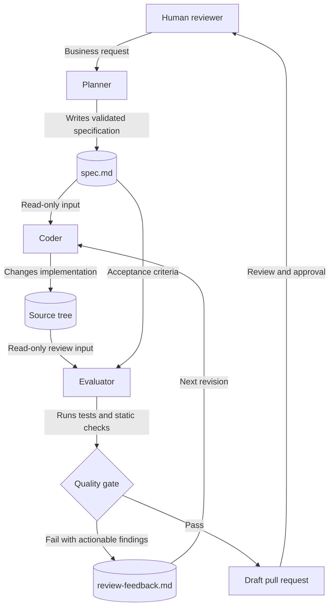
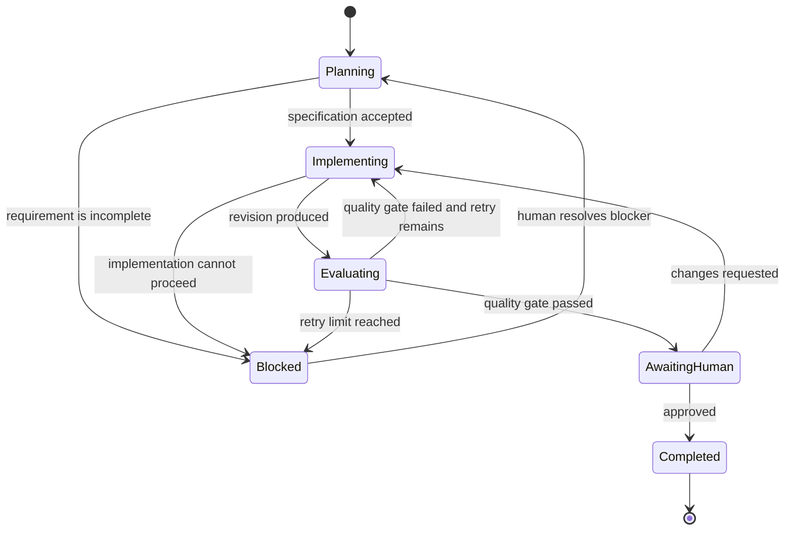

# mrg architecture

This document is the source of truth for the planned multi-agent workflow. The diagram describes control flow; the contracts below define behavior that implementations must preserve.

## System context

## Workflow states

## Agent contracts

### Planner

- Reads the request and relevant repository context.
- Writes `spec.md` with scope, assumptions, acceptance criteria, constraints, affected interfaces, and a validation plan.
- Does not edit production code.
- Marks unresolved product decisions explicitly instead of inventing requirements.

### Coder

- Treats an accepted `spec.md` as its implementation contract.
- Changes only the files required by the specification and follows `.github/copilot-instructions.md`.
- Runs the checks named in the validation plan and records command results.
- Does not weaken tests or quality gates merely to obtain a passing result.

### Evaluator

- Reviews the implementation against the specification and observable behavior.
- Runs tests, static analysis, and targeted checks independently of the Coder's report.
- Writes `review-feedback.md` with severity, file/location, evidence, and a concrete expected outcome for each failure.
- Returns pass only when all acceptance criteria and required checks succeed.
- Does not modify production code while acting as Evaluator.

### Human reviewer

- Resolves ambiguous requirements, approves exceptions, and owns the final merge decision.
- Reviews a passing revision before it can be merged or released.

## Harness responsibilities

The harness owns orchestration rather than business logic. It must:

1. Persist the current state, attempt number, artifacts, and command results.
2. Give each agent only the inputs declared in its contract.
3. Validate required artifacts before advancing the state.
4. Apply a configurable retry limit and stop on repeated failures.
5. Preserve complete execution logs while removing secrets and credentials.
6. Require human approval before merge, deployment, or another irreversible action.

## Artifact schemas

`spec.md` must contain:

- Problem and desired behavior
- In-scope and out-of-scope work
- Assumptions and unresolved questions
- Acceptance criteria written as observable outcomes
- Technical constraints and affected interfaces
- Validation commands or checks

`review-feedback.md` must contain:

- Overall result: `PASS` or `FAIL`
- Checks executed and their results
- Findings ordered by severity
- Evidence and reproduction steps for each failure
- Remaining risks or skipped checks

## Quality gate

A revision passes only when all acceptance criteria are satisfied, required checks exit successfully, no unresolved high-severity finding remains, and no required validation was skipped. The harness must treat missing evidence as a failure rather than assuming success.

## Change policy

Update this document in the same change whenever agent responsibilities, workflow states, artifact contracts, approval boundaries, or quality gates change. Implementation details may evolve without an architecture update when these contracts remain intact.
